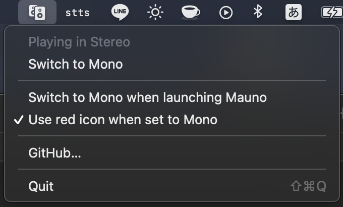
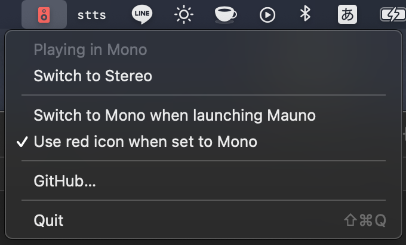

# Mauno

A tiny Mac menubar app that allows you to quickly switch audio from Stereo to Mono — really useful for those one-sided YouTube videos.

[Download](http://mahdi.jp/apps/mauno)

License is GNU GPLv2.

### Changelog

#### 2.0 (2021)

- Rewritten in Swift & added Apple Silicon support
- Codesigned & notarized
- Added more settings and better menubar icons

#### 1.0 (2012)

- Initial version
